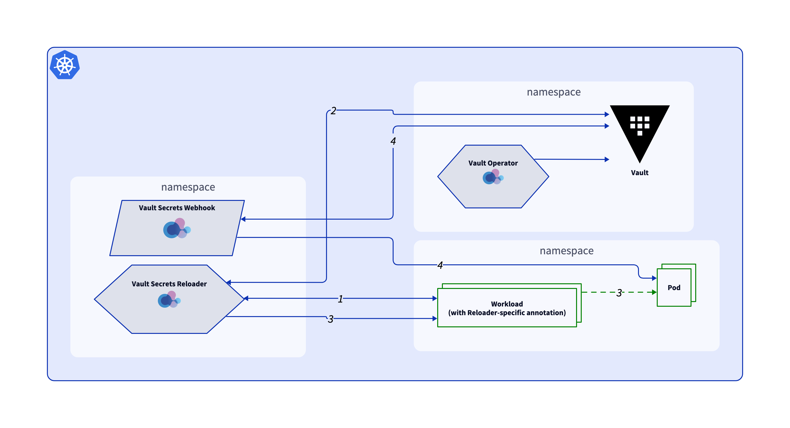

# Vault Secrets Reloader and the Bank-Vaults ecosystem

If you are familiar with the Bank-Vaults [Vault Secrets Webhook](https://github.com/bank-vaults/vault-secrets-webhook), you are probably aware of it only injecting secrets when the pods are created/recreated, and until the release of this tool, there were no solution within the Bank-Vaults ecosystem to inject secrets into these workloads in a continuous manner. Vault Secrets Reloader offers Vault Secrets Webhook users an automated solution for this problem.

This is a high level overview of how the Reloader plays along with other components of the Bank-Vaults ecosystem:

1. The `collector` worker periodically collects unversioned secrets from workloads with the `alpha.vault.security.banzaicloud.io/reload-on-secret-change: "true"` annotation that are in the format for injection by the Webhook.

2. At its scheduled time, the `reloader` worker checks in Vault if there is a new version of any of the collected secrets since the last sync. If it is the case, it continues to step 3, otherwise the workflow stops.

3. The `reloader` changes another Reloader-specific annotation in the affected workload's podspec, triggering a new rollout.

4. The pods are recreated and the Webhook can do its job again by injecting the latest version of the secrets from Vault into the pod's containers.
